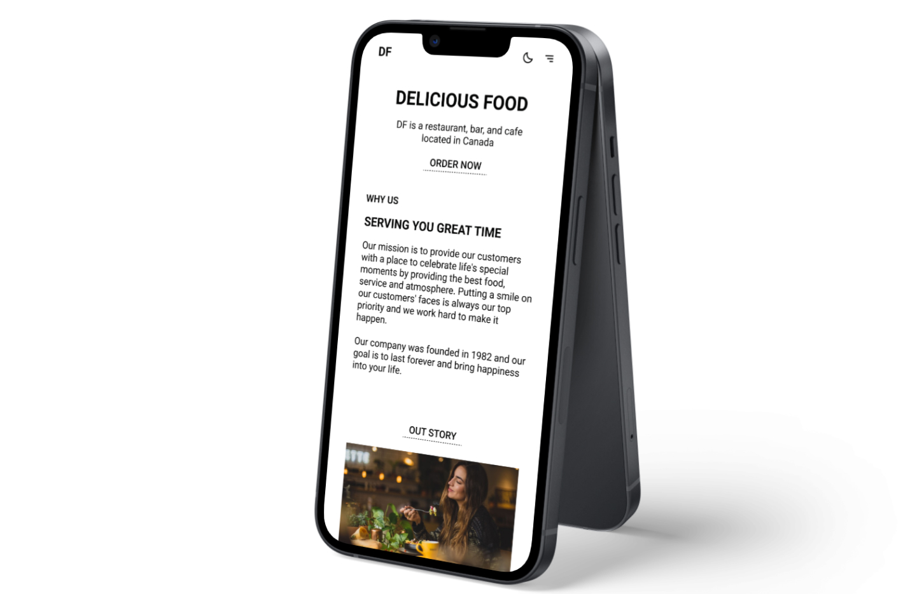

# [D-FOOD :plate_with_cutlery:](https://delifoodc.netlify.app/)

Welcome to Delicious Food. This is a website that shows Delicious Food's menu, where it is located, when it was founded, what its main mission is, etc. It has a section to send an email to improve the restaurant. It has the following sections **Home**, **About**, **Contact** and **Menu**.

## Built with

## Goals

Some of the goals of this project are the following:

- **Make a website accessible.**
- **Website with a correct SEO.**
- **Website Adaptable to any screen resolution.**

Achieved goals

The proposed goals for this project were met. :smiling_face_with_three_hearts:

- **Make a website accessible.** :white_check_mark:
- **Website with a correct SEO.** :white_check_mark:
- **Website Adaptable to any screen resolution.** :white_check_mark:

## Dependencies

Some dependencies I used were the following:

- **React Router Dom**
- **React Icons**
- **AOS**

And the following development dependencies:

- **ESLint**
- **Standard**

## Author

Some of my platforms

- [GitHub](https://github.com/FLCHRIS)
